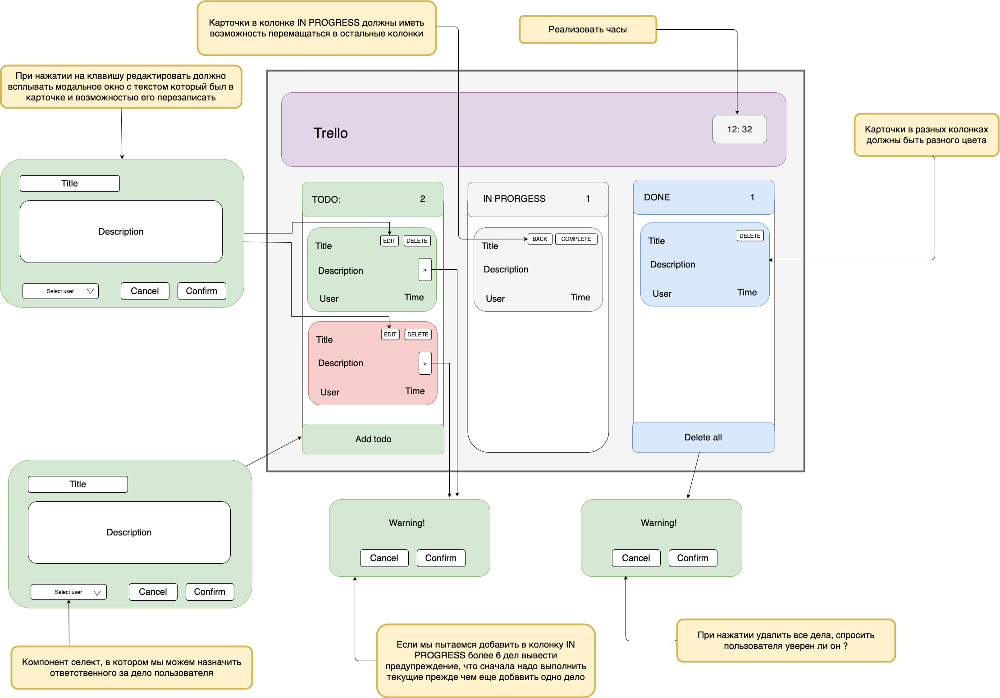

<p align='right'>< TeachMeSkills /></p>
<h1 align="center">TRELLO APPLICATION</h1>

---
    Читать learn.javascript.ru:
    п.6.1 - 6.11
    п.8.1 - 8.4
    п.9.1 - 9.6
    п.10.1, 10.2
    п.11.1 - 11.8
    п.13.1 - 13.3
    
---

### Useful Links

 1. [Event Loop: learn.javascript.ru](https://learn.javascript.ru/event-loop)
 2. [Event Loop (realtime): latentflip](http://latentflip.com/loupe/?code=JC5vbignYnV0dG9uJywgJ2NsaWNrJywgZnVuY3Rpb24gb25DbGljaygpIHsKICAgIHNldFRpbWVvdXQoZnVuY3Rpb24gdGltZXIoKSB7CiAgICAgICAgY29uc29sZS5sb2coJ1lvdSBjbGlja2VkIHRoZSBidXR0b24hJyk7ICAgIAogICAgfSwgMjAwMCk7Cn0pOwoKY29uc29sZS5sb2coIkhpISIpOwoKc2V0VGltZW91dChmdW5jdGlvbiB0aW1lb3V0KCkgewogICAgY29uc29sZS5sb2coIkNsaWNrIHRoZSBidXR0b24hIik7Cn0sIDUwMDApOwoKY29uc29sZS5sb2coIldlbGNvbWUgdG8gbG91cGUuIik7!!!PGJ1dHRvbj5DbGljayBtZSE8L2J1dHRvbj4%3D)
 3. [jsonplaceholder](https://jsonplaceholder.typicode.com)
 4. [mockapi.io](https://mockapi.io/)

## Trello APP
```
    Стек технологий для приложения: чистые HTML, CSS, JavaScript
```

  1. Создается публичный репозиторий на github
  2. Приложение публикуется на github-pages
  3. Описание приложение в REAMDE
  4. Получение, хранение, изменение данных: [mockapi](https://mockapi.io/)

---

